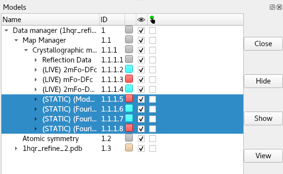

ChimeraX-Clipper Commands
=========================

The primary purpose of ChimeraX-Clipper is to facilitate the handling of
crystallographic maps and symmetry in ChimeraX. However, it's not restricted to
crystallographic data: real-space volumetric maps of any kind may be associated
with your model to provide a unified visualisation scheme
(see :ref:`associate`). Using Clipper you can open (:ref:`open`) and save
(:ref:`save`) structure factors in MTZ format, and explore the detailed fit of
you model to maps (see :ref:`spotlight` and :ref:`isolate`). Where applicable,
a model initialised for ChimeraX-Clipper will provide a real-time display of
crystallographic symmetry-related molecules.

.. _`open`:

clipper open
------------

*(NOTE: MTZ files - but not .cif files - may also be opened using the standard
ChimeraX open command, with otherwise identical syntax to that described below)*

Syntax: clipper open *path* [**structureModel** *structure*]
[**overSampling** *number*]

Open a structure factor file in .mtz or .cif format, and generate maps for the
model specified with *structureModel*.

If the structure factor file contains pre-calculated amplitudes and phases, they
should appear in the file in strict (Amplitudes, Phases, Amplitudes, Phases)
order. ChimeraX-Clipper will create one map for each set it finds, and prepend
'(STATIC)' to its name. To close any unwanted maps, look in the ChimeraX Models
panel under "Data manager"/"Map Manager"/"Crystallographic maps", select the
maps you wish to remove and click "Close":

Experimentally-measured reflections may be provided as amplitudes (F/sigF),
intensities (I/sigI), or their anomalous counterparts (F+/sigF+/F-/sigF- or
I+/sigI+/I-/sigI-) and should be stored in the file in these orders. Only one
set of experimental data will be used, with intensities preferred. If
intensities are provided, they will be internally converted to amplitudes using
the analytical French & Wilson method of `Read et al.`_. Anomalous datasets will
be merged.

.. _Read et al.: https://journals.iucr.org/d/issues/2016/03/00/dz5382/index.html

When experimental reflections are found, three live-updating maps will be
created (with "(LIVE)" prepended to their names). The first of these is a
standard 2mFo-DFc map, while the second is a 2mFo-DFc map with a degree of
B-factor sharpening or smoothing applied. The level of sharpening or smoothing
depends on the resolution of the data: maps with resolutions worse than 2.5Å
will be sharpened, while higher-resolution maps will be smoothed. The sharper
of the two maps will be displayed as a transparent surface, the other as a
wireframe. Finally, a standard mFo-DFc map will be generated and displayed
with contours at ± 3 sigma.

.. _`save`:

clipper save
------------

*(NOTE: This command is also available via the top-level ChimeraX "save" command
with identical behaviour and syntax)*

Syntax: clipper save *filename* [*models*]
[**preserveInput** *true/false* (false)]
[**saveMapCoeffs** *true/false* (false)]

Save one or more sets of reflection data to (a) MTZ file(s). If more than one
dataset is specified by *models*, they will be saved as a series of files
(*filename*-0.mtz, *filename*-1.mtz, etc.) numbered in the order they are found
in the ChimeraX model tree.

If *preserveInput* is true, then the original experimental data loaded from file
will be saved, with "in." prepended to the column labels. **(IMPORTANT NOTE: if
the data was originally loaded from .cif, ONLY the columns selected by Clipper
for map calculations will be passed through)**

If *saveMapCoeffs* is true, amplitudes and phases for Clipper's current
Fc, 2Fo-Fc and Fo-Fc maps will be saved.

Free flags and the Fobs/SigFobs arrays used by Clipper will always be saved.

.. _`associate`:

clipper associate
-----------------

Syntax: clipper associate *volumes* [toModel *structure*]

Have ChimeraX-Clipper take control of the chosen volumes and associate them with
the given model.

In order to work with ChimeraX-Clipper's visualisation modes, a volumetric map
(such as a cryo-EM map) must first be associated with an atomic model using this
command.

.. _`spotlight`:

clipper spotlight
-----------------

Syntax: clipper spotlight [*structures*] [**radius** *number*]

Initiate "spotlight mode" (a sphere of visible atoms and density following the
centre of rotation) for the given models, and optionally set the radius of the
sphere. If *structures* is not specified, the command will only apply to models
which are already initialised into the ChimeraX-Clipper data structure.

.. _`isolate`:

clipper isolate
---------------

Syntax: clipper isolate *atoms* [**surroundDistance** *number* (0.0)]
[**contextDistance** *number* (5.0)] [**maskRadius** *number* (3.0)]
[**hideSurrounds** *true/false* (true)] [**focus** *true/false* (false)]
[**includeSymmetry** *true/false* (true)]

Visually isolate the selected atoms from their surroundings, and mask all
associated maps to cover the immediate vicinity. The algorithm for deciding
the final view is as follows:

1. The *atoms* selection is expanded to complete residues.
2. All residues with any atoms within *surroundDistance* of any atoms in the
   results from (1) are added to the selection. If *includeSymmetry* is true,
   symmetry atoms within the *surroundDistance* will also be included. The final
   selection at this stage will be covered by the map(s).
3. *(This step only has an effect if hideSurrounds is true)* All residues with
   any atoms within *contextDistance* of the results from (2) will be displayed,
   but not covered by the map(s). If *includeSymmetry* is true, symmetry atoms
   will be included.
4. All maps associated with the model are masked down to within *maskRadius* of
   the atoms specified in (2).
5. If *hideSurrounds* is true, all atoms not found in (1) or (2) will be hidden.
   Cartoon display will not be affected.
6. If *focus* is true, the view will be reset to centre on and encompass the
   covered region.
