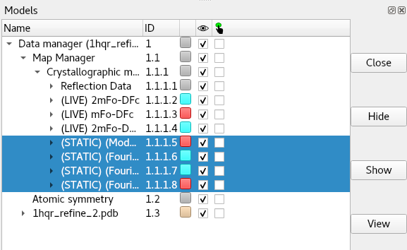

.. _clipper_commands:

Commands
========

The primary purpose of ChimeraX-Clipper is to facilitate the handling of
crystallographic maps and symmetry in ChimeraX. However, it's not restricted to
crystallographic data: real-space volumetric maps of any kind may be associated
with your model to provide a unified visualisation scheme
(see :ref:`associate`). Using Clipper you can open (:ref:`open`) and save
(:ref:`save`) structure factors in MTZ format, and explore the detailed fit of
you model to maps (see :ref:`spotlight` and :ref:`isolate`). Small-molecule
crystals (e.g. from the Crystallography Open Database) can be opened with live
symmetry and maps using :ref:`smallmol` and :ref:`cod`. Where applicable,
a model initialised for ChimeraX-Clipper will provide a real-time display of
crystallographic symmetry-related molecules.

.. _`open`:

clipper open
------------

*(NOTE: MTZ files - but not .cif files - may also be opened using the standard
ChimeraX open command, with otherwise identical syntax to that described below)*

Syntax: clipper open *path* [**structureModel** *structure*]
[**overSampling** *number*] [**radiation** *xray/electron/auto* (auto)]

Open a structure factor file in .mtz or .cif format, and generate maps for the
model specified with *structureModel*.

If the structure factor file contains pre-calculated amplitudes and phases, they
should appear in the file in strict (Amplitudes, Phases, Amplitudes, Phases)
order. ChimeraX-Clipper will create one map for each set it finds, and prepend
'(STATIC)' to its name. To close any unwanted maps, look in the ChimeraX Models
panel under "Data manager"/"Map Manager"/"Crystallographic maps", select the
maps you wish to remove and click "Close":

Experimentally-measured reflections may be provided as amplitudes (F/sigF),
intensities (I/sigI), or their anomalous counterparts (F+/sigF+/F-/sigF- or
I+/sigI+/I-/sigI-) and should be stored in the file in these orders. Only one
set of experimental data will be used, with intensities preferred. If
intensities are provided, they will be internally converted to amplitudes using
the analytical French & Wilson method of `Read et al.`_. Anomalous datasets will
be merged.

.. _Read et al.: https://journals.iucr.org/d/issues/2016/03/00/dz5382/index.html

When experimental reflections are found, three live-updating maps will be
created (with "(LIVE)" prepended to their names). The first of these is a
standard 2mFo-DFc map, while the second is a 2mFo-DFc map with a degree of
B-factor sharpening or smoothing applied. The level of sharpening or smoothing
depends on the resolution of the data: maps with resolutions worse than 2.5Å
will be sharpened, while higher-resolution maps will be smoothed. The sharper
of the two maps will be displayed as a transparent surface, the other as a
wireframe. Finally, a standard mFo-DFc map will be generated and displayed
with contours at ± 3 sigma.

The **radiation** keyword selects the scattering-factor table used to calculate
structure factors from the model:

* ``xray`` (default) - X-ray form factors (Waasmaier & Kirfel), for conventional
  X-ray crystallography;
* ``electron`` - electron form factors (Peng, *International Tables* Vol C), for
  **electron diffraction (micro-ED / 3D-ED)** data. Electrons scatter from the
  electrostatic potential rather than the electron density, so the live maps and
  the reported R-factors are then correct for an electron-diffraction experiment.
  Any genuine monatomic ions in the model (e.g. an ordered ``Na+``, ``Ca2+`` or
  ``Cl-``) use the corresponding Peng-1998 ionic electron factors where tabulated,
  falling back to the neutral element otherwise;
* ``auto`` (default) - infer the radiation, in order of reliability, from the
  associated model's mmCIF ``_exptl.method`` (``ELECTRON CRYSTALLOGRAPHY`` vs
  ``X-RAY DIFFRACTION``), then from a structure-factor CIF's
  ``_diffrn_radiation_probe``; anything undeclared (e.g. a bare MTZ with no model
  metadata) resolves to X-ray. In practice this means electron-diffraction entries
  are detected automatically while conventional X-ray data is unaffected.

Because the model header is the primary signal, structure factors fetched from
the PDB are handled correctly with no extra input - e.g. for a micro-ED entry,
``open 8xyz structureFactors true`` auto-selects electron factors. An explicit
``radiation xray`` or ``radiation electron`` always overrides the auto-detection.

.. _`smallmol`:

clipper smallmol
----------------

Syntax: clipper smallmol *path* [**hkl** *path*]
[**radiation** *xray/electron/auto* (auto)]

Open a small-molecule CIF (the "core CIF" dialect used by, e.g., the
Crystallography Open Database) as a live crystal structure: the model in its
unit cell, crystallographic symmetry mates, and - when experimental reflections
are available - live-updating electron-density maps. This is the small-molecule
counterpart to :ref:`open` (which handles macromolecular MTZ/structure-factor
data); use *smallmol* for single-molecule crystals where the unit cell and
symmetry come from the model's own CIF.

*path* is the model CIF. Reflections may be supplied in either of two ways:

* explicitly, with the **hkl** keyword, pointing at a small-molecule
  structure-factor file (itself a CIF, conventionally with a ``.hkl``
  extension, containing a ``_refln_`` loop of squared structure factors
  ``F_squared_meas``); or
* implicitly - if **hkl** is omitted, a sibling file alongside *path* with the
  same stem and a ``.hkl`` extension is used automatically when present.

If no reflections are found the model is still opened with its unit cell and
symmetry, but no maps are created.

When reflections are present, two live maps are generated (with "(LIVE)"
prepended to their names) and recomputed as the model moves:

* a **2mFo-DFc** map, contoured over the model, and
* an **mFo-DFc** difference map.

These follow the small-molecule conventions rather than the macromolecular ones
used by :ref:`open`. Structure factors are calculated by FFT with **no bulk
solvent** (small-molecule crystals are densely packed) and scaled onto the
observed amplitudes with an anisotropic-Gaussian-plus-isotropic-spline scaling;
there is no σA weighting and no free set. The difference map is contoured at an
**absolute level in e/ų** (not the ± 3 σ used for macromolecular maps): the
familiar "3 σ" rule of thumb is calibrated for protein maps and is misleading at
small-molecule data quality, where a residual peak is best judged against an
absolute electron-density scale.

The **radiation** keyword selects the scattering-factor table used for the
calculated structure factors:

* ``xray`` (X-ray form factors; Waasmaier & Kirfel, including ionic species
  declared in the CIF ``_atom_site_type_symbol`` such as ``Cu2+`` / ``O2-``);
* ``electron`` (electron form factors; Peng 1996/1998, *International Tables*
  Vol C), for **electron diffraction — micro-ED / 3D-ED** data. Electron scattering
  senses the electrostatic potential, so the calculated maps and R-factor are
  correct for electron-diffraction experiments. Ionic species declared in the CIF
  (``Cu2+``, ``O2-``, ...) use Peng-1998 ionic electron factors, including the
  divergent Coulomb term of the ionic charge (the R-factor uses the full ionic
  factor; live maps use the screened part, since the Coulomb term is a long-range
  potential with no localised density).
* ``auto`` (default) reads ``_diffrn_radiation_probe`` from the CIF and uses
  electron factors when it names electrons, otherwise X-ray.

.. _`cod`:

clipper cod
-----------

Syntax: clipper cod *id* [**ignoreCache** *true/false* (false)]
[**radiation** *xray/electron/auto* (auto)]

Fetch a structure from the Crystallography Open Database
(https://www.crystallography.net) by its numeric COD *id*, then open it with
:ref:`smallmol`. Both the model (``<id>.cif``) and, when the entry provides
them, its structure factors (``<id>.hkl``) are downloaded; roughly 10% of COD
entries include structure factors, and only those will produce live maps.

Downloads are cached locally; pass **ignoreCache true** to force a fresh fetch.
The **radiation** keyword is passed through to :ref:`smallmol` (X-ray, electron
for micro-ED, or auto-detected from the CIF).

For example, ``clipper cod 1100908`` fetches the Cu complex used as a bundled
example (see :ref:`smallmol_examples`).

.. _`smallmol_examples`:

Example data
------------

A couple of small-molecule examples (model + structure factors) are installed
alongside the bundle so the above commands can be tried offline:

* ``cod_1100908`` - a Cu complex in C 1 2/c 1 (#15), with the metal on a 2-fold
  special position (published R = 0.041);
* ``cod_2213867`` - an organic structure in P b c a (#61).

To locate them, run this in the ChimeraX Python shell (Tools → General → Shell)::

    import os, chimerax.clipper
    print(os.path.join(os.path.dirname(chimerax.clipper.__file__), 'demo'))

then, for example::

    clipper smallmol <that-folder>/cod_1100908.cif hkl <that-folder>/cod_1100908.hkl

.. _`save`:

clipper save
------------

*(NOTE: This command is also available via the top-level ChimeraX "save" command
with identical behaviour and syntax)*

Syntax: clipper save *filename* [*models*]
[**preserveInput** *true/false* (false)]
[**saveMapCoeffs** *true/false* (false)]

Save one or more sets of reflection data to (a) MTZ file(s). If more than one
dataset is specified by *models*, they will be saved as a series of files
(*filename*-0.mtz, *filename*-1.mtz, etc.) numbered in the order they are found
in the ChimeraX model tree.

If *preserveInput* is true, then the original experimental data loaded from file
will be saved, with "in." prepended to the column labels. **(IMPORTANT NOTE: if
the data was originally loaded from .cif, ONLY the columns selected by Clipper
for map calculations will be passed through)**

If *saveMapCoeffs* is true, amplitudes and phases for Clipper's current
Fc, 2Fo-Fc and Fo-Fc maps will be saved.

Free flags and the Fobs/SigFobs arrays used by Clipper will always be saved.

.. _`associate`:

clipper associate
-----------------

Syntax: clipper associate *volumes* [toModel *structure*]

Have ChimeraX-Clipper take control of the chosen volumes and associate them with
the given model.

In order to work with ChimeraX-Clipper's visualisation modes, a volumetric map
(such as a cryo-EM map) must first be associated with an atomic model using this
command.

.. _`spotlight`:

clipper spotlight
-----------------

Syntax: clipper spotlight [*structures*] [**radius** *number*]

Initiate "spotlight mode" (a sphere of visible atoms and density following the
centre of rotation) for the given models, and optionally set the radius of the
sphere. If *structures* is not specified, the command will only apply to models
which are already initialised into the ChimeraX-Clipper data structure.

.. _`isolate`:

clipper isolate
---------------

Syntax: clipper isolate *atoms* [**surroundDistance** *number* (0.0)]
[**contextDistance** *number* (5.0)] [**maskRadius** *number* (3.0)]
[**hideSurrounds** *true/false* (true)] [**focus** *true/false* (false)]
[**includeSymmetry** *true/false* (true)]

Visually isolate the selected atoms from their surroundings, and mask all
associated maps to cover the immediate vicinity. The algorithm for deciding
the final view is as follows:

1. The *atoms* selection is expanded to complete residues.
2. All residues with any atoms within *surroundDistance* of any atoms in the
   results from (1) are added to the selection. If *includeSymmetry* is true,
   symmetry atoms within the *surroundDistance* will also be included. The final
   selection at this stage will be covered by the map(s).
3. *(This step only has an effect if hideSurrounds is true)* All residues with
   any atoms within *contextDistance* of the results from (2) will be displayed,
   but not covered by the map(s). If *includeSymmetry* is true, symmetry atoms
   will be included.
4. All maps associated with the model are masked down to within *maskRadius* of
   the atoms specified in (2).
5. If *hideSurrounds* is true, all atoms not found in (1) or (2) will be hidden.
   Cartoon display will not be affected.
6. If *focus* is true, the view will be reset to centre on and encompass the
   covered region.
